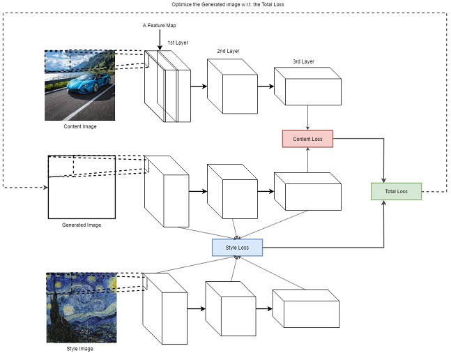

<!-- PROJECT LOGO -->
 

  

<h3 align="center">Nueral Style Transfer</h3>

  

    Nueral Style Transfer on the VGG19 model
     
    <a href="https://github.com/nikhilreddy2002/Envision-Real-Time-Style-Transfer"><strong>Explore the docs »</strong></a>

  

<!-- TABLE OF CONTENTS -->

  
Table of Contents

  <ol>
    <li><a href="#about-the-project">About The Project</a></li>
    <li><a href="#the-vgg19-model">The VGG19 model</a></li>
    <li><a href="#implementation">Implementation</a></li>
    <li><a href="#results">Results</a></li>
    <li><a href="#acknowledgments">Acknowledgments</a></li>
  </ol>

<!-- ABOUT THE PROJECT -->
## About The Project

Style Transfer is the process in which one image is composed in the style of another image. We are going to use deep learning in order to make this possible. The process in itself is called neural style transfer and the technique comes from A Neural Algorithm of Artistic Style (<a href=https://arxiv.org/abs/1508.06576>by Gatys et al.</a>).

Neural style transfer is an optimization technique that takes two images - a content image and style reference image. The deep net blends these images together so that the output image looks like the content image, but it seems as though it were “painted” in the style of the reference image.

The implementation involves optimization of the output image to match the content statistics of the content image and the style statistics of the reference image. These statistics are extracted from the images using a convolutional network.

## The VGG19 model

VGG is a deep CNN used to classify images. The layers in VGG19 model are as follows:
* Conv3x3 (64)
* Conv3x3 (64)
* MaxPool
* Conv3x3 (128)
* Conv3x3 (128)
* MaxPool
* Conv3x3 (256)
* Conv3x3 (256)
* Conv3x3 (256)
* Conv3x3 (256)
* MaxPool
* Conv3x3 (512)
* Conv3x3 (512)
* Conv3x3 (512)
* Conv3x3 (512)
* MaxPool
* Conv3x3 (512)
* Conv3x3 (512)
* Conv3x3 (512)
* Conv3x3 (512)
* MaxPool
* Fully Connected (4096)
* Fully Connected (4096)
* Fully Connected (1000)
* SoftMax

## Implementation
a loss function which blends two images seamlessly to create visually appealing art, NST defines the following inputs:

* A content image (c) — the image we want to transfer a style to
* A style image (s) — the image we want to transfer the style from
* An input (generated) image (g) — the image that contains the final result (the only trainable variable) 

The architecture of the model as well as how the loss is computed is shown below.

The Content loss is calculated by taking the norm of the generated image and the content image for the activations (a) of any layer (l).
## Jcontent \[l\] = || a \[l\] \(c\) - a \[l\] \(g\) || 2
The Style loss is calculated by taking the norm of the Gram matrix(Gs) of the style image and the generated image (Gg) activations (a) of any layer (l).
## Jstyle \[l\] = || G \[l\] \(s\) - G \[l\] \(s\) || 2
The Gram matrices Gs and Gg are calculated by multiplying the activation of the layer (l) with its transpose. 

The final loss function is a combination of both for different layers.
## J(G)  = 	$\alpha$ * Jcontent + $\beta$ * Jstyle
where alpha and beta are hyperparameters.

 

## <a href="https://github.com/nikhilreddy2002/Envision-Real-Time-Style-Transfer"><strong>Find the code here»</strong></a>

 

## Results

### Content Image

### Style Image

 

|0 epochs|1000 epochs|2000 epoch|
|---|---|---|
||||

|3000 epochs|4000 epochs|5000 epoch|
|---|---|---|
||||

 

<!-- ACKNOWLEDGMENTS -->
## Acknowledgments

* [A Neural Algorithm of Artistic Style
Leon A. Gatys, Alexander S. Ecker, Matthias Bethge](https://arxiv.org/abs/1508.06576)
* [CNN by Andrew Ng](https://www.youtube.com/watch?v=ArPaAX_PhIs&list=PLkDaE6sCZn6Gl29AoE31iwdVwSG-KnDzF)

